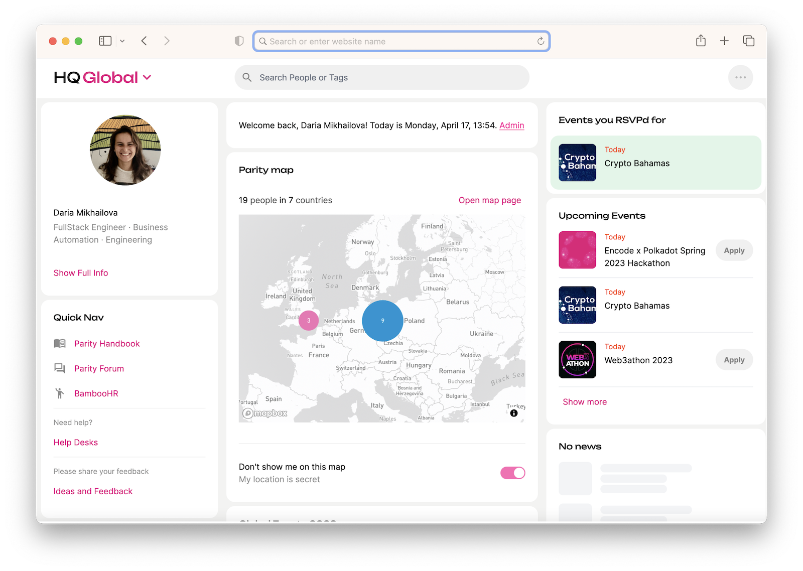

<div align="center">
  

# Polkadot Hub App

</div>

Polkadot Hub App is a self-hosted web app for managing offices, meeting rooms, events, and people profiles. It's an opinionated hackspace-like approach for hybrid teams distributed across many continents and working on multiple projects. The app is written in React, Node.js and Postgres.

Main features:

- Multiple office locations + "Global" page for remote workers
- Internal user profiles with custom tags, locations, timezones and onboarding
- Flexible role system for access management
- Google authentication ("Log in with Polkadot" button is in progress)
- Modular architecture that allows you to expand the app with new widgets and integrations with external APIs



## Getting Started

- [Quick start: How to create a new office](./docs/create-new-office.md)
- [How to set up tablets as wall displays for meeting rooms](./docs/tablet-setup.md)

## Modules and Integrations

All user-facing widgets of the application are (and should be) located in its own modules, which can depend on other modules, as well as use integrations to communicate with external services. Each module manages its own router and can implement all the necessary pages, widgets, webhooks for itself. Integrations are used to store credentials for different external services (e.g., sending email), so that you don't have to reconfigure this at each module level.

### Modules

- **[Desk Management](./src/modules/visits/):** Admins can upload floor plans and allow users to book desks in the office. The system also supports additional check-in forms.
- **[Meeting Room Booking](./src/modules/room-reservation/):** This feature is similar to desk booking, but for reserving meeting rooms. It also includes a special tablet-mode for on-wall devices.
- **[Guest Invites](./src/modules/guest-invites/):** Users can invite guests to the office with or without additional admin approval.
- **[Event Management](./src/modules/events/):** Special pages for events, with different visibility options (invites only, office-wide, public), and the ability to attach a check-in form asking attendees for necessary information, such as food preferences or flight times.
- **[Forms](./src/modules/forms/):** Self-hosted Google Forms replacement that allows users to create feedback forms and other types of forms. It also supports exporting data to .CSV files.
- **[Help Center](./src/modules/help-center/):** Static pages and a sidebar widget for displaying any type of static information to users, such as links to the employee handbook, equipment request forms, public holidays, and more.
- **[Onboarding Checklist](./src/modules/onboarding/):** Checklist-like widget that guides users through a list of tasks they need to complete when onboarding. It can contain links to educational materials, other modules, or other actions, such as setting up VPN access.
- **[News](./src/modules/news/):** Simple static news module with a widget and different visibility options.

### Integrations

- **[Matrix](./src/integrations/matrix/).** Send notifications to Matrix rooms or users.
- **[Email-SMTP](./src/integrations/email-smtp/).** Notifications via email.
- **[BambooHR](./src/integrations/bamboohr/)** Allow modules to parse information from BambooHR API.

## Running HQ App locally

### [Quick start](docs/quickstart.md)

### Manual

To run the app on your local machine for development purposes, follow these steps:

1. Clone the repository to your local machine:

   ```
   git clone git@github.com:paritytech/parity-portal-hq.git
   ```

2. Install dependencies (of course, make sure you have Node 18+ and yarn installed on your machine):

   ```
   yarn install
   ```

3. Generate all missing files with type definitions, so your IDE won't complain for errors.

   ```
   yarn client:build
   ```

4. Set up a Postgres database. Use whatever method is convenient for you like Docker or [Postgres.app](https://postgresapp.com/downloads.html).

5. Create your own `.env` file in the root directory of the app with all necessary configuration using provided [.example.env](./.example.env) as a template.

6. Create database schema

   ```
   yarn migrations:up
   ```

7. Run the project

   ```
   yarn server:watch
   ```

   ```
   yarn client:watch
   ```

   Go to [http://127.0.0.1:3000](http://127.0.0.1:3000)

## Deployment

We are working on simplifying the deployment process of our application. Right now it's very much tailored to our infrastructure, so you'll have to write a lot of configs yourself to get it up and running.

### Option 1. Using Helm charts

Use our charts from the [helm](./helm/) folder as an example to create your own.

### Option 2: Docker compose

Take a look at our [docker-compose.yml](./docker-compose.yml) and use it as inspiration for your own deploy. Don't forget to make the postgres database container persistent or use a managed solution.

## Bugs and Ideas

If you want to report a bug or suggest an improvement, welcome to our [Issues](https://github.com/paritytech/parity-portal-hq/issues). Please describe the reproduction steps and attach any details that will help us understand your problem.

## License

Polkadot Hub App is [Apache-2.0 licensed](./LICENSE).
